# ceiling-light

# Smart PWM LED Strip Controller
This is short project description of my personal struggle with build dreamed smart ceiling in my leaving room

## Dreams and plans

*??*

Found solutions:

1. CartoonLight L-16
https://www.youtube.com/watch?v=iwvV4xV2fUY
1. Lumines - na sprężyny
http://lumines.pl/produkty/profil-montazowy-lumines-talia-m3,2339,.html
1. Zwykły szeroki profil LUMINES
http://lumines.pl/produkty/profil-lumines-modi,184,.html

## Building construction
First of all my "smart" ceiling was dreamed to be done in living room. As you can see on *img1* image there is also kitchen over there. This is just a project from my developer with my first idea of where to put led lines and how to cross it to spend less money and get the best visual effect and usability.

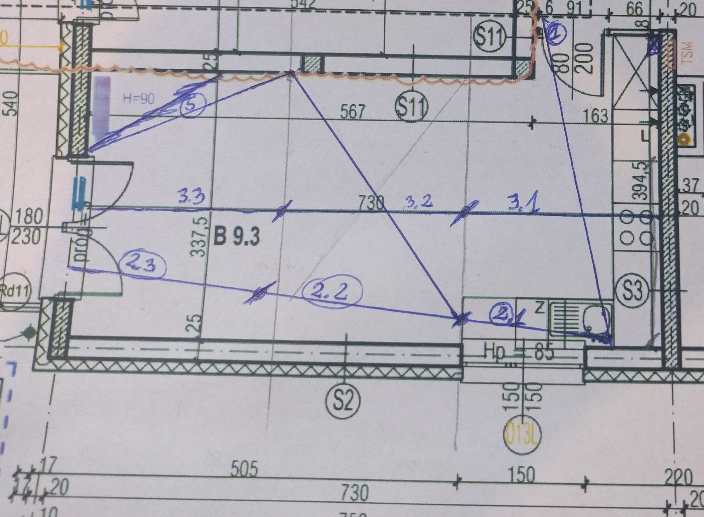
*img1: First idea scratched to paper project*

As you can see, first attempt was not so well done. There is not so many cros of lighting strip to have expected efect.

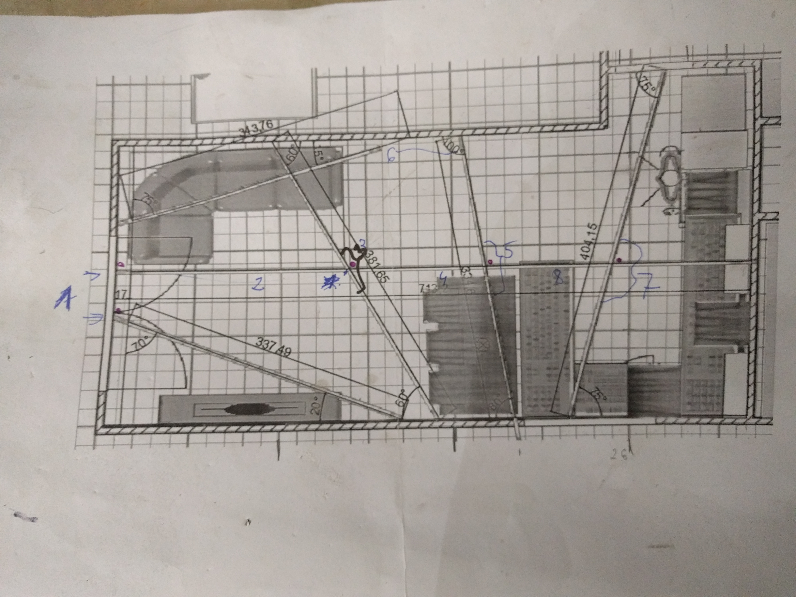
*img2: Final idea painted in simple 'design' software*

In this image i realize how big this room really is and also i decided place of dining table and couch.

Finally i decide to have 1 parallel line across whole room and 4 strip with some cross point somewhere outside room. This create problem - how to mount led profiles.

In sumarry i have to order:
7 x 3m profile
5 x 1m profile
SUM 26m profile

Over there i planned to place warm, cold and rgb strip.

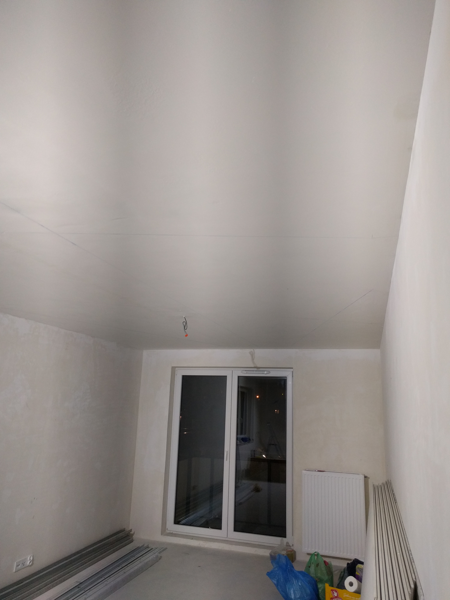
*img3: All lines are painted on ceiling with chalk line*

*chalk line*

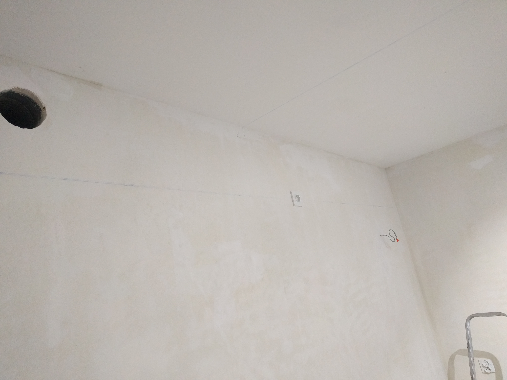
*img4: All lines are painted on ceiling with chalk line*

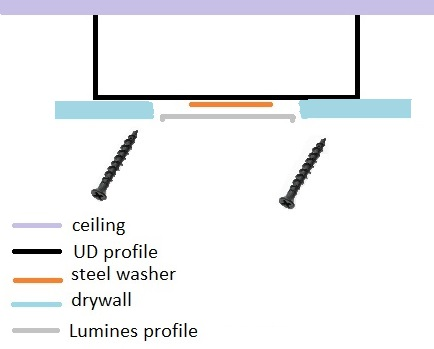
*drawing1: How to handle led profile?*

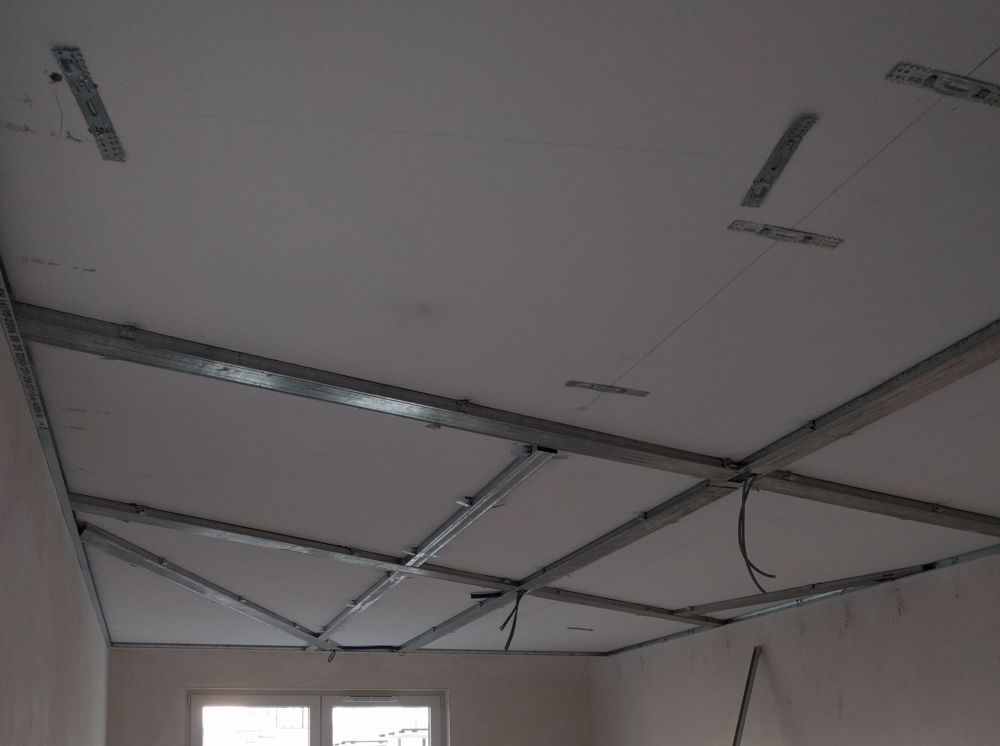
*img5: Metal frame*

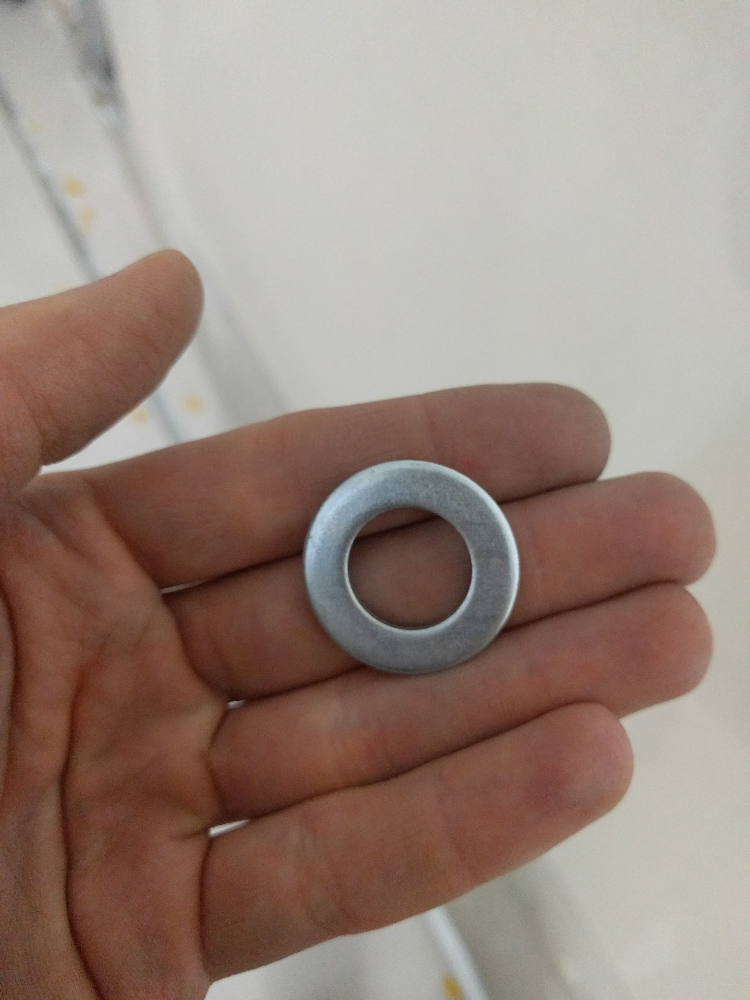
*img5a: Steel washer*

Tu generalna idea co i jak 

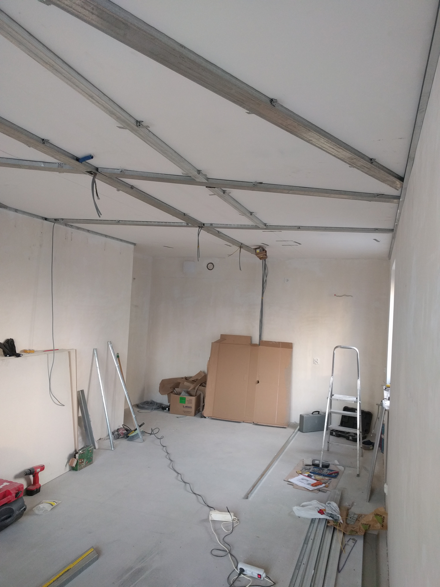
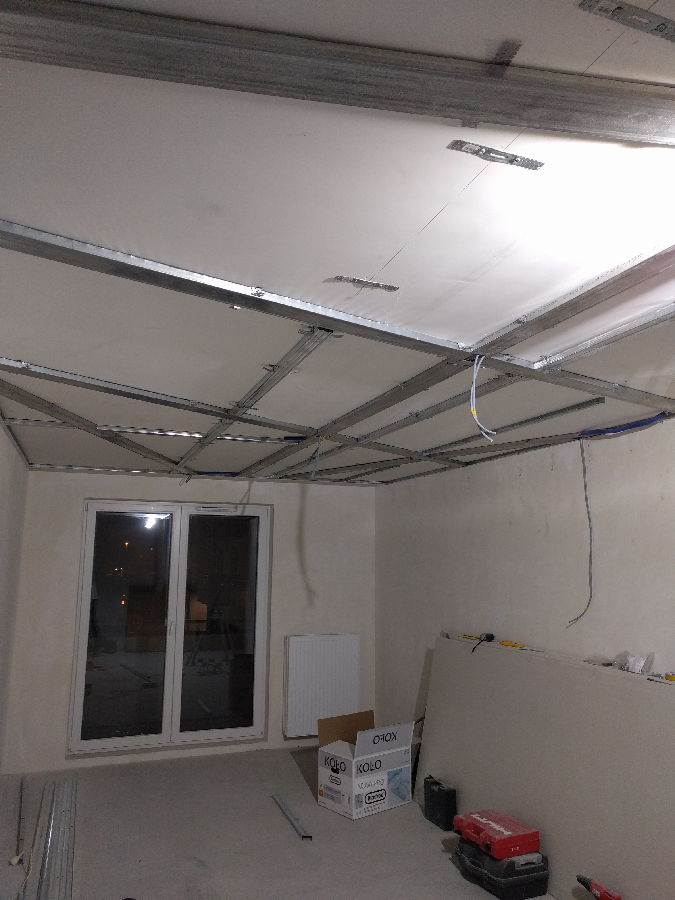
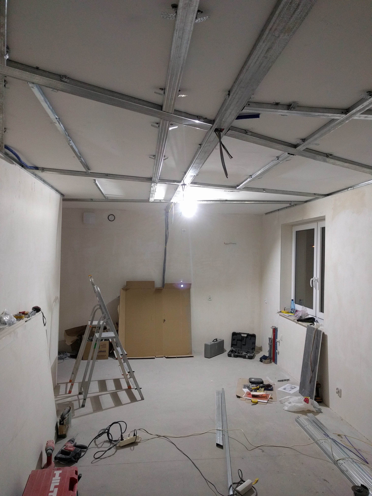
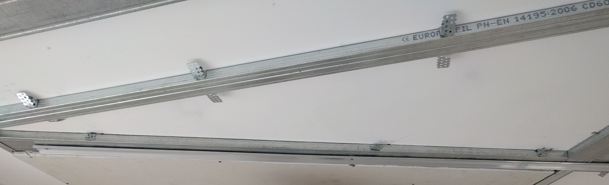
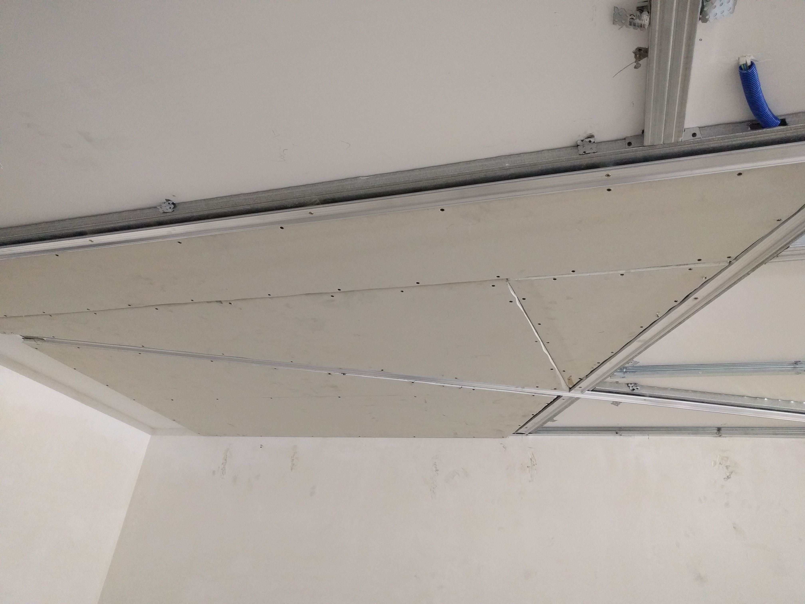
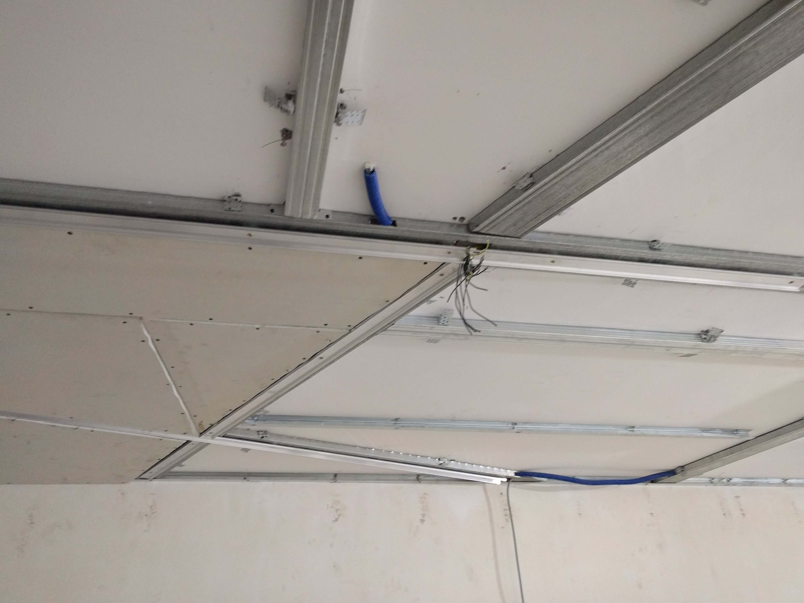

## Prototypowanie

ESP8266 ma 6? wyjść PWM

Jak to powiększyć?
-Przerzutnik 
-https://tech.scargill.net/16-channels-of-pwm-for-esp8266/

## Budowa płytki

## Oprogramowanie

Dlaczego custom soft?
1. Dla ćwiczenia, odkrywania czegoś nowego w świecie IoT
1. Chęć dużej customizacji zachowania poszczególnych punktów świetlnych 
    1. PWM dimming z regulacją czasu osiągnięcia zadanej wartości wyjścia
    1. Strona serwerowa również pisana przezemnie w najnowszych technologiach firmy Microsoft 
1. Rozwiązanie całkowicie offline
1. Nie znalazłem podobnego projektu 

