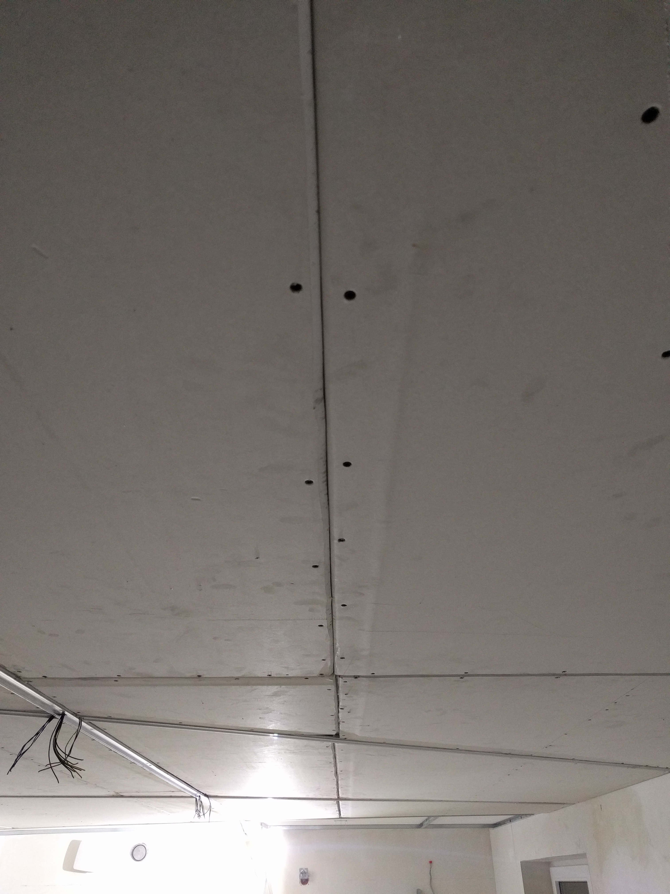

# ceiling-light - Smart PWM LED Strip Ceiling

This is short project description of my personal struggle with build dreamed smart ceiling in my leaving room.

## Dreams and plans

Idea was, to build cool and effective smart ceiling.

Requirements:

1. Many independent lighting points
1. PWM brightness control
1. Ability to controls over phone/PC
1. Use actual electricity network
1. Use regular power switch to turn on and off
1. Have crossed many led strip
1. Warm and Cold white light
1. Contain RGB lighting

*Inspiration ceiling 1*

# Building ceiling

First of all my "smart" ceiling was dreamed to be done in living room. As you can see on *img1* image there is also kitchen over there - this part require a lot of light. This is just a project from developer with my first idea of where to put led lines and how to cross it to spend less money and get the best visual effect and usability.

*img1: First idea scratched to paper project*

As you can see, first attempt was not so well done. There is not so many crosses of lighting strip to have expected effect.

*img2: Final idea painted in simple 'design' software*

In this image i realize how big this room really is and i also decided where to put dining table and couch.

Finally i decide to have 1 parallel line across whole room (where i planned to place warm, cold and rgb strip) and 4 profiles with some cross point somewhere outside room. This create problem - how to mount led profiles.

During quite long research and struggling with very hight costs of build i have found few solutions:

## CartoonLight L-16

https://www.youtube.com/watch?v=iwvV4xV2fUY

Unfortunately i cannot find distributor for Poland

## Lumines recessed architectural profile

http://lumines.uk/produkty/profil-lumines-typ-intalia-wpuszczany,2383,.html

This profile are quite good, but they require many space under my ceiling, so i lost 60cm of storey height.

## Lumines wide profile

http://lumines.uk/produkty/lumines-modi,198,.html

This is the simplest wide profile i have found. It is also the cheapest solution! So this is my choice.

In summary i have to order:

7 x 3m profile

5 x 1m profile

SUM 26m profile

I started with mark all profiles with chalk line.

*img3: All lines are painted on ceiling with chalk line*

*chalk line*

*img4: All lines are painted on ceiling with chalk line*

Because chosen Lumines profile have about 10 cm height i need to put in somehow drywall on the sime level.

I decided to use UD profile as base. Whole 'construction' is presented on drawing1.

*drawing1: How to handle led profile?*

*img5: Metal frame*

*img5a: Steel washer*

*img5b: Mounting steel washer on double sided tape*

*img6*

*img7*

*img8*

*img9*

*img10*

*img11*

*img13*

*img14: Total ceiling height*

*img15*

*img16*

*img17*

*img18*

*img19*

*img21*

*img22*

*img23*

*img24: First white LED strip mounted*

## Hardware

First of all i had to choose which controller to choose to write program for.

Requirements:

1. Arduino compatible
1. With wifi
1. Cheap

My choose is **ESP8266**. It is very cheap (2$), fast (80MHz)and available in many stores.

I used D1 Mini NodeMcu for easier soldering and it contain usb port with programmer.

*img25: WEMOS D1 Mini*

ESP8266 contains 8 output pins with PWM modulation. For such controller it is a lot, but for my project this is not much.

I choose Adafruit 16-channel 12-bit PWM board (PCA8685). It is very cheap and it can be connected to another module (up to 6!). This give us 16 channels to manage! :)

*img26: 16-channel 12-bit PWM board*

Unfortunately output power is not enough to power so long led strips. I have to use transistors.
For such project i can project custom PCB and solder everything to it, but i wanted this project to be as modular as possible. This is my only lighting in room, so in case of failure some of module i can very fast replace it and fix problem.

*img27: N-mosfet transistors board with PCA8685*

*img28: N-mosfet transistors board with PCA8685*

*img29: First attempt to connect everything up to test software*

*img30: First connect to strips*

What a cable mess you could ask. And i will agree with you! That's why i think - if in software we are scared of big monolith infrastructure and we are trying to divide big system to small parts and call it services/microservices, why cannot i do the same with my project?

The first thing to divide is handling regular power switch to turn on and off light.

*img31: Separate module for handling power switch state*

## Software

I decided to write code by my own because:

1. I want to practice programming
1. I want to have pet project where i can test cutting edge technologies
1. Not standard requirements will be very hard to configure in universal solutions like supla
1. I wanted 100% offline solution

For now my central website is hosted on my local small server under docker container with my custom MVC website and API.

In case of power switch change state, microcontroller from img31 send request to server to handle it.

In SQL database i have defined events and assigned reaction to it.

If i turn on switch nr1, then led strips from 0 to 6 all goes to 60% of brightness.

TBC